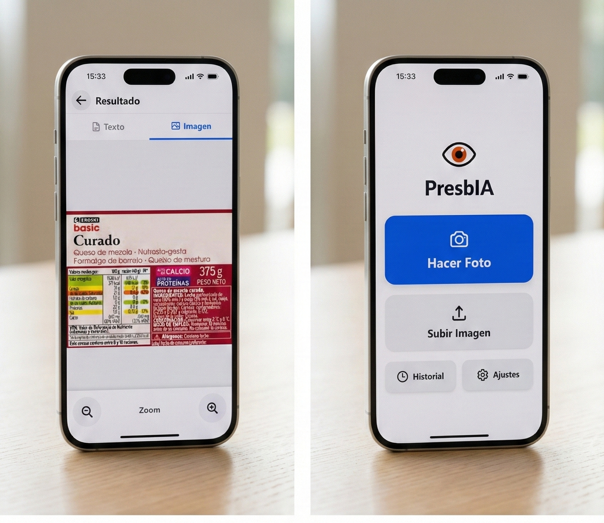
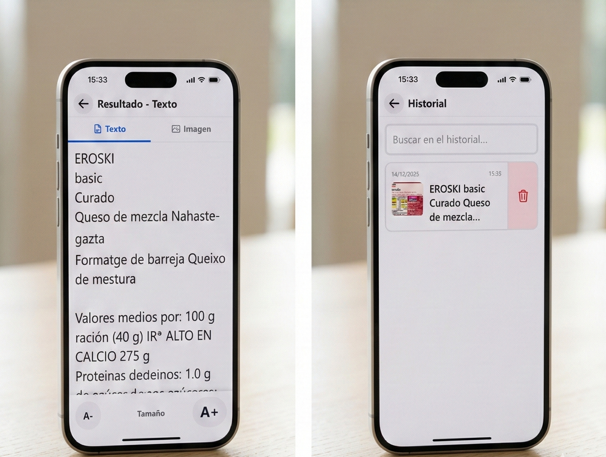

# PresbIA 👁️

> **Herramienta de Accesibilidad Visual Impulsada por IA**

PresbIA es una aplicación web progresiva (PWA) diseñada para asistir a personas con presbicia o dificultades visuales. Utiliza inteligencia artificial avanzada para extraer texto de imágenes en tiempo real y presentarlo en un formato legible, adaptable y de alto contraste.

> **[🚀 PRUEBA LA DEMO EN VIVO AQUÍ](https://ai.studio/apps/drive/13li20uB3lsa8zkpA-NMq7oOWjmcpkqlv)**

## 🚀 Sobre el Proyecto

Este proyecto demuestra la integración de tecnologías web modernas con servicios de IA para resolver un problema de accesibilidad real.

**Objetivo:** Proporcionar una herramienta sencilla y potente que permita a los usuarios leer menús, etiquetas, libros o cualquier texto pequeño utilizando la cámara de su dispositivo.

### 🛠️ Stack Tecnológico

*   **Frontend:** [React 19](https://react.dev/) - Biblioteca para interfaces de usuario.
*   **Lenguaje:** [TypeScript](https://www.typescriptlang.org/) - Para un código robusto y tipado.
*   **Build Tool:** [Vite](https://vitejs.dev/) - Entorno de desarrollo ultrarrápido.
*   **Estilos:** [Tailwind CSS](https://tailwindcss.com/) - Diseño responsivo y sistemas de temas.
*   **IA / OCR:** [Google Gemini API](https://ai.google.dev/) - Motor de visión y extracción de texto.
*   **Almacenamiento:** LocalStorage (Persistencia de historial y ajustes).

## ✨ Características Principales

*   **📸 Escaneo Inteligente:** Captura fotos o sube imágenes para extraer texto automáticamente usando la API de Gemini.
*   **🔍 Visualización Adaptable:**
    *   Ajuste dinámico de tamaño de fuente (desde 16px hasta 80px).
    *   Zoom táctil en imágenes originales.
*   **🎨 Temas de Accesibilidad:**
    *   Claro / Oscuro.
    *   **Alto Contraste:** Texto amarillo sobre fondo negro.
    *   **Invertido:** Texto negro sobre fondo amarillo.
*   **💾 Historial Local:** Guarda tus escaneos recientes para consultarlos sin conexión.
*   **📱 PWA Ready:** Diseño responsive optimizado para móviles y tablets.

## � Galería

<p align="center">
  
  &nbsp; &nbsp;
  
</p>

## �📦 Instalación y Uso

Sigue estos pasos para ejecutar el proyecto en tu entorno local:

1.  **Clonar el repositorio:**
    ```bash
    git clone <tu-url-del-repositorio>
    cd presbia
    ```

2.  **Instalar dependencias:**
    ```bash
    npm install
    ```

3.  **Configurar Variables de Entorno:**
    Crea un archivo `.env.local` en la raíz del proyecto y añade tu API Key de Google Gemini:
    ```env
    VITE_GEMINI_API_KEY=tu_api_key_aqui
    ```
    *(Nota: Asegúrate de obtener tu API Key en [Google AI Studio](https://aistudio.google.com/))*

4.  **Iniciar el servidor de desarrollo:**
    ```bash
    npm run dev
    ```

5.  **Construir para producción:**
    ```bash
    npm run build
    ```

## 📄 Licencia

Este proyecto está bajo la Licencia MIT. Consulta el archivo `LICENSE` para más detalles.

---
*Desarrollado con ❤️ y tecnología para un mundo más accesible.*
